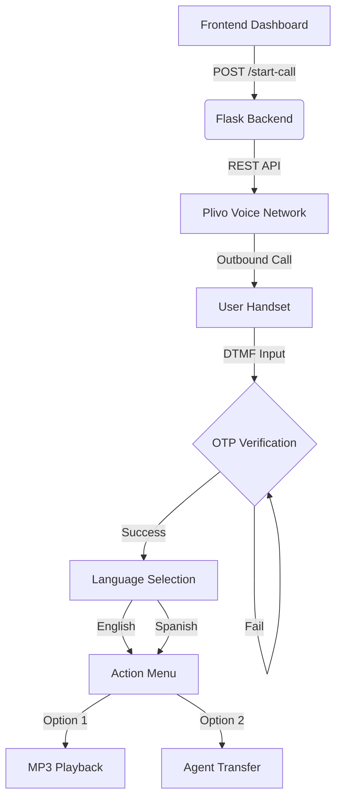

# 🎙️ InspireWorks: Secure Multi-Level Plivo IVR

A state-of-the-art, communication-forward IVR (Interactive Voice Response) system designed for the **Forward Deployed Engineer (FDE)** role. This project leverages the **Plivo Voice API** to deliver a secure, multilingual, and highly interactive user experience.

---

## ✨ Features & Highlights

### 🛡️ Security First
- **DTMF OTP Shield**: Every call starts with a mandatory 4-digit authentication barrier.
- **Persistence**: Incorrect OTP attempts are handled gracefully with looping re-prompts.
- **Hardcoded Protocol**: Secured with a custom DDMM birthdate key (1503).

### 🌍 Global Experience
- **Bi-Lingual Engine**: Seamless switching between **English (US)** and **Spanish (US)**.
- **Dynamic TTS**: Context-aware Text-to-Speech that adapts to user selection in real-time.

### ⚡ Professional Dashboard
- **AJAX-Powered**: Trigger calls without a single page refresh.
- **Visual Call-Flow**: Real-time visualization of the protocol architecture.
- **Premium Aesthetics**: Fully responsive design featuring **Dark/Light mode**, glassmorphism, and smooth CSS animations.

---

## 📐 System Architecture



---

## 🛠️ Tech Stack

| Component | Technology |
| :--- | :--- |
| **Server** | Python 3.x, Flask |
| **Voice API** | Plivo SDK |
| **Frontend** | HTML5, CSS3, Vanilla JS (ES6+), Jinja2 |
| **Tunneling** | Ngrok |
| **Config** | Dotenv (Environment Variables) |

---

## 📋 Setup & Deployment

### 1. Prerequisites
- [Plivo Account](https://www.plivo.com/) + Voice-enabled number.
- [Ngrok](https://ngrok.com/) for webhook tunneling.
- Python 3.8+ installed.

### 2. Installation
```bash
git clone https://github.com/meetkothariii0/Plivo1.git
cd Plivo1
python3 -m venv .venv
source .venv/bin/activate
pip install -r requirements.txt
```

### 3. Environment Configuration
Create a `.env` file in the root directory:
```env
PLIVO_AUTH_ID=your_id
PLIVO_AUTH_TOKEN=your_token
PLIVO_FROM_NUMBER=your_plivo_number
BASE_URL=your_ngrok_url
OTP=1503
AUDIO_URL=https://www.soundhelix.com/examples/mp3/SoundHelix-Song-1.mp3
LIVE_AGENT_NUMBER=+919820096764
```

---

## 🏃 Execution Guide

1.  **Expose Port**: Run `ngrok http 5001`.
2.  **Update BASE_URL**: Paste the ngrok URL into your `.env`.
3.  **Launch App**: Run `python app.py`.
4.  **Engage**: Open `http://localhost:5001`, enter your number, and experience the IVR.

---

## 🎥 Loom Demo Outline (Recommended)

1.  **Dashboard Intro**: Show the UI, toggle Dark/Light mode.
2.  **Trigger**: Show the AJAX trigger (no refresh).
3.  **Authentication**: Answer the phone, enter wrong OTP, then correct OTP (**1503**).
4.  **Navigation**: Go through Language selection -> Action selection.
5.  **Final Payload**: Demonstrate the MP3 playback and the Agent bridge.
6.  **Backend Audit**: Briefly show the terminal logs for validation.

---

## 📁 Repository Contents

- `app.py`: The core engine handling webhooks and UI logic.
- `make_call.py`: Standalone CLI utility for outbound triggers.
- `static/`: Premium CSS assets with dark/light mode variables.
- `templates/`: Modern Jinja2 templates.
- `requirements.txt`: Project dependencies.
- `.env.example`: Template for quick setup.

---
*Created for the InspireWorks Technical Assignment.*
